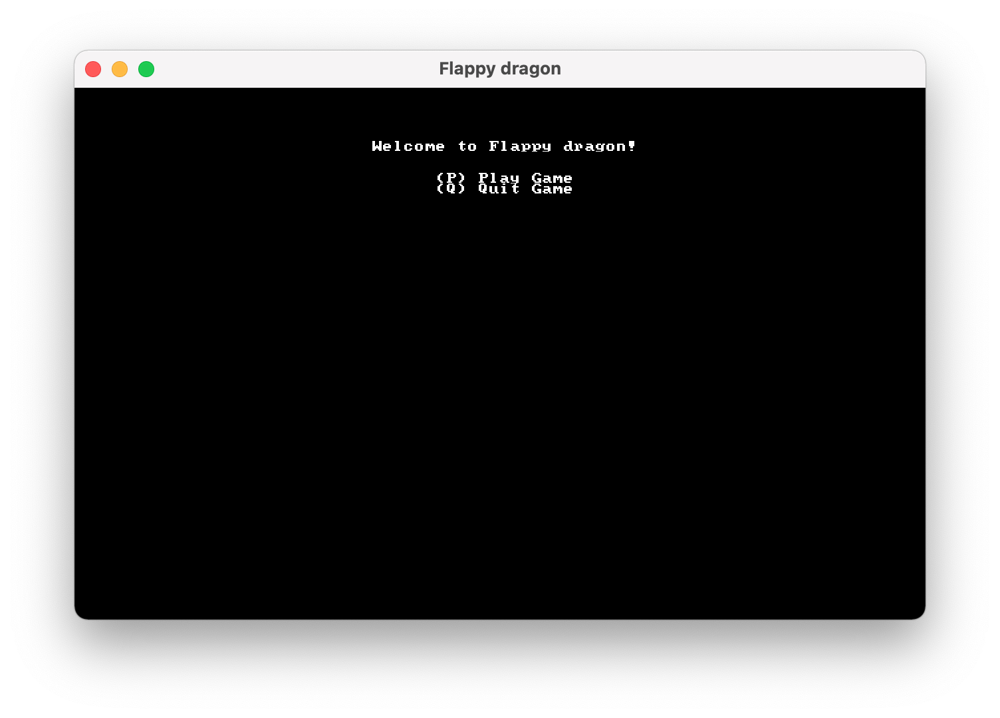

#Overview
We'll be building a flappy-bird clone called _flappy dragon_. Code is [in the flappy_dragon directory](/flappy_dragon)

## Implementing Traits
Traits are a way to define shared functionaly for objects. To define a `GameState` trait to a `State` struct, write

```rust
impl GameState for State {
	fn tick(&mut, self, ctx: &mut BTerm) {
	ctx.cls();
	ctx.print(1, 1, "Hello, bracket Terminal!");
	}
}
```

## Playing the game
Run the game with
```bash
cargo run
```
and a terminal window should pop up with the main menu:



